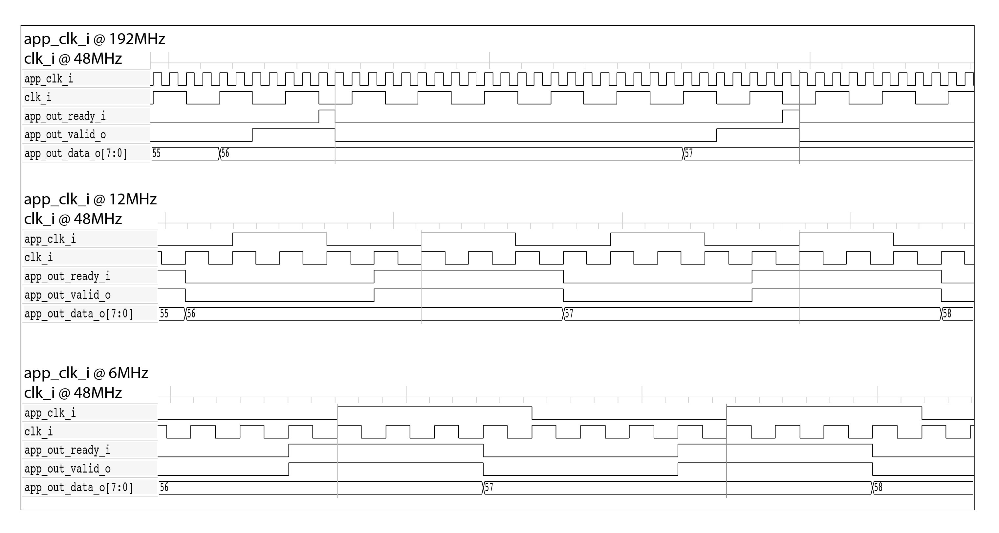

### Design goals:
1. Full implementation of USB CDC device features with in mind future reuse for other USB device classes.
2. Asynchronous clocks between internal USB stuff and the rest of FPGA logic.
3. Small footprint and no use of EBR memories for an easy ASIC implementation.
4. Architecture that support an high clock frequency for internal USB\_CDC logic to allow implementation on a wide range of FPGA and ASIC technologies.
5. Low power consumption.

### Architecture
USB\_CDC is built on a minimum number of functional blocks:

1. PHY\_RX shall sample USB lines at 12MHz * BIT\_SAMPLES and manage physical layer signaling such as NRZI decoding, bit stuffing removal, and data deserialization. It detects USB reset too.
2. PHY\_TX shall manage physical layer signaling such as NRZI encoding, bit stuffed insertion, and data serialization.
3. SIE shall embed PHY\_RX and PHY\_TX modules and manage physical and protocol layers with packet recognition, transaction sequencing, CRC generation/checking, packet ID (PID) generation, and checking/decoding.
4. CTRL\_ENDP shall implement IN/OUT Control Endpoint. It shall manage control transfers by providing device descriptors, keeping device status/address, and responding to standard and ACM subclass requests.
5. BULK\_ENDP shall implement IN/OUT Bulk Endpoint and IN/OUT FIFO interface.
6. USB\_CDC shall implement the top level by embedding SIE and control/bulk endpoints.

This partitioning helps to confine the modifications in case of reuse for a new device class implementation. For example, PHY\_TX, PHY\_RX, SIE and both IN\_FIFO and OUT\_FIFO shall remain unchanged. CTRL\_ENDP shall be changed to implement the new class-specific descriptors and request responses. BULK\_ENDP shall be removed/modified to meet new class requirements. New isochronous/interrupt/bulk endpoints shall be added to meet new class requirements.

### Data flow and FIFO
Data flows from/to PHY\_RX/PHY\_TX directly through SIE to OUT/IN endpoints. SIE keeps the minimum data necessary to check/generate CRC. This keeps logic utilization at a minimum. Furthermore, this helps to meet timings too. Indeed USB data is elaborated byte by byte at the full-speed USB rate (1.5MBs), and there is plenty of time between one byte and the next one.

CTRL_ENDP elaborates this data in real-time without storing it. If an error is detected, then the current operation is aborted, and a proper response is provided to SIE.

BULK\_ENDP collects OUT data into FIFO, and at the end of an OUT bulk transfer without errors makes it available to the external logic. Otherwise, OUT FIFO is flushed from incomplete data. Just after each OUT byte is consumed, it is flushed from FIFO. Conversely, when BULK\_ENDP receives IN data from external logic, it stores it into IN FIFO and makes it available immediately to SIE. After IN data is transferred to the USB host without errors, it is flushed from IN FIFO. Otherwise, it is kept to be retransmitted with the next IN transfer.

### Asynchronous clock domains
USB data can be exchanged with external USB\_CDC logic through the same clock `clk_i` or with an asynchronous one `app_clk_i`.
This choice is made through a Verilog parameter and implemented through a generate construct.

Synchronization between the two clock domains is made on valid/ready control signals with double synchronization flip-flops to avoid metastability. These flip-flops are clocked by `app_clk_i` for signals that belong to the `clk_i` domain and vice versa by `clk_i` for signals that belong to the `app_clk_i` domain. So, to synchronize back and forth the control signals, this requires on average about 2\*2.5 `app_clk_i` cycles + 2\*2.5 `clk_i` cycles.
If freq(`app_clk_i`) &le; 12MHz then it is possible to guarantee a safe synchronization with double synchronization flip-flops clocked by `clk_i` only. This improves data throughput.

If freq(`app_clk_i`) &le; 12MHz then data is exchanged at every 1 or 2 `app_clk_i` cycles.

USB data is transferred at a maximum byte rate of 1.5MHz, so data transfer is limited by USB if freq(`app_clk_i`) >= 1.5MHz. Otherwise, data is exchanged at a byte rate of freq(`app_clk_i`).

### Clock gating
Clock gating is extensively used to allow high clock frequencies and reduce power consumption by exploiting USB peculiarities.

A frequency of 12MHz * BIT\_SAMPLES is exclusively employed in PHY\_RX and IN\_FIFO/OUT\_FIFO for signal synchronization between asynchronous clock domains. For all other logic circuitry, a clock gating mechanism is utilized to enable the clock every BIT\_SAMPLES cycles. This approach eases the timing closure to adhere to the 12MHz clock frequency by implementing a multi-cycle path constraint equal to BIT\_SAMPLES.

USB device serializes data at 12MHz frequency. Data is transferred internally at byte chunks with a lower frequency of  1.5MHz.
Synplify Pro is aware of these timings with the definition of multi-cycle path constraints. Yosys/nextpnr doesn't allow to specify timing constraints, so if timings are not met, there is a good chance that USB\_CDC works correctly.  
Fomu up5k logic is slower than TinyFPGA-BX lp8k logic, so Yosys/nextpnr report a false timing failure @48MHz. Whereas SynplifyPro shows the actual timing closure with no timings failure thanks to timings constraints.

In an ASIC device, clock gating is implemented directly on the clock tree. This significantly reduces power consumption by shutting down clock switching when data transfer is not requested.

In an FPGA device, clock gating is implemented through the flip-flop enable pin. This additional path makes easier the timing closure.
